## Open questions {background-color="#0D4F77" .center}

::: {style="color: white; font-size: 0.95em;"}
- Through which **channel** did your recent stories reach their audience?
- Do you anticipate that channel in advance, or **frame** a story to maximize its reach on a given platform?
- How often do you question your **reach figures** and ask why a story **over- or under-performed**?
:::

---

## Core questions of this session

::: {style="margin-top: 0.6em;"}
::: {.incremental}
1. How has the transition to **recommender-system platforms** reshaped the **production, distribution, and consumption** of news?
2. What **normative consequences** does this transition carry?
3. **What can be done** about it?
:::
:::

---

## Three affordances of the rec-sys platforms

::: {.columns}
::: {.column width="50%"}
::: {.incremental}
- **Mobile-first** consumption
- **Short** video clips
- **Recommender system** curation
:::
:::

::: {.column width="50%"}
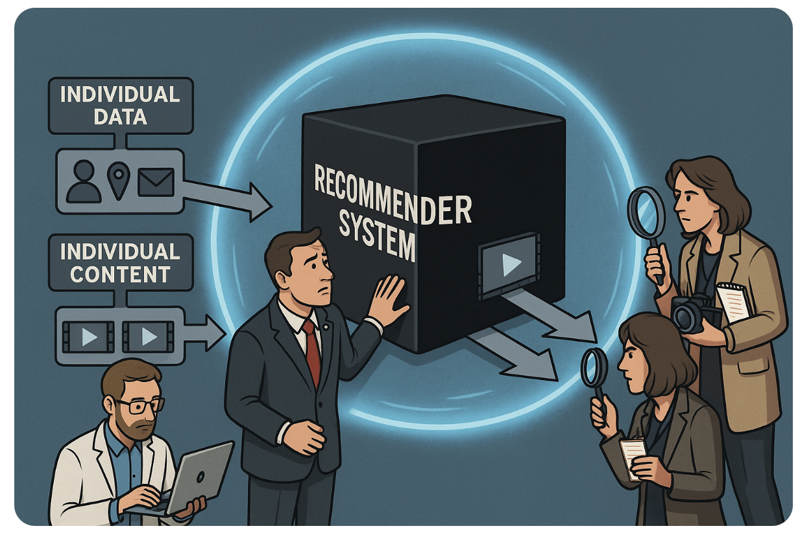{width="90%" fig-align="center"}
:::
:::

::: {.fragment style="margin-top: 0.8em; text-align: center; font-style: italic;"}
Combined, these affordances set up a dialectic between **short format** and the **recommender system**.
:::

---

## Subscription vs. recommender-based platforms

```{=html}
<table class="table" style="font-size: 0.75em; border-collapse: collapse; margin: 0.5em auto; width: 100%;">
  <thead>
    <tr>
      <th style="background-color: #0D4F77; color: white; padding: 0.4em 0.9em; font-weight: 700; text-align: left;"></th>
      <th style="background-color: #0D4F77; color: white; padding: 0.4em 0.9em; font-weight: 700; text-align: left;">Subscription logic</th>
      <th style="background-color: #0D4F77; color: white; padding: 0.4em 0.9em; font-weight: 700; text-align: left;">Recommendation logic</th>
    </tr>
  </thead>
  <tbody>
    <tr>
      <td style="padding: 0.4em 0.9em; border-bottom: 1px solid #ddd; font-weight: 700;">Who owns the audience</td>
      <td style="padding: 0.4em 0.9em; border-bottom: 1px solid #ddd;">The <strong>producer</strong></td>
      <td style="padding: 0.4em 0.9em; border-bottom: 1px solid #ddd;">The <strong>platform</strong></td>
    </tr>
    <tr class="fragment" style="background-color: #f7f7f7;">
      <td style="padding: 0.4em 0.9em; border-bottom: 1px solid #ddd; font-weight: 700;">How distribution works</td>
      <td style="padding: 0.4em 0.9em; border-bottom: 1px solid #ddd;">Readers picked a newspaper and came back to it; reach was predictable</td>
      <td style="padding: 0.4em 0.9em; border-bottom: 1px solid #ddd;">Feed assembled per user, per session</td>
    </tr>
    <tr class="fragment">
      <td style="padding: 0.4em 0.9em; border-bottom: 1px solid #ddd; font-weight: 700;">Following an account</td>
      <td style="padding: 0.4em 0.9em; border-bottom: 1px solid #ddd;">Meant you were served the content</td>
      <td style="padding: 0.4em 0.9em; border-bottom: 1px solid #ddd;">No longer guarantees you see it</td>
    </tr>
  </tbody>
</table>
```

::: {.fragment style="margin-top: 1em; text-align: center; font-size: 1.05em;"}
The relationship with the audience **changes hands**.
:::

---

## The dialectic between format and algorithm

```{=html}
<div style="display: flex; align-items: center; justify-content: center; gap: 1.5em; margin-top: 1.2em;">
  <div style="text-align: right; flex: 1; font-size: 1.05em; line-height: 1.5;">
    Short format<br><strong style="color: #0D4F77;">enables</strong> the algorithm<br><span style="color: #708090;">(fine-grained behavioral data)</span>
  </div>
  <div style="font-size: 3em; color: #0D4F77;">&#10231;</div>
  <div style="text-align: left; flex: 1; font-size: 1.05em; line-height: 1.5;">
    The algorithm <strong style="color: #0D4F77;">makes</strong><br>short format viable<br><span style="color: #708090;">(it provides the navigation)</span>
  </div>
</div>
```

::: {.fragment style="margin-top: 1.2em; text-align: center; font-size: 1.1em;"}
Each is made viable by the other: **lower production costs**, **more attention to distribute**, **more data**.
:::

---

## The power shift

::: {.incremental}
- By taking over the **circulation of content**, the algorithm subordinates **both producers and consumers**.
- Producers optimize less for the **audience's satisfaction** and more for the **algorithm's**.
- Consumers no longer control what they are exposed to, **weakening the feedback** that once held producers accountable to demand.
:::

---

## Open question {background-color="#0D4F77" .center}

::: {style="color: white; font-size: 1.05em;"}
If you needed to report on **something happening on social media**, how would you proceed?

**Where would you even look?**
:::

---

## The reporting gap

::: {.definition}
Experiences are **individualized** to a degree where aggregating a handful of observations is **risky**: your feed, a colleague's, a screenshot do not add up to what the platform actually showed people.
:::

::: {.fragment style="margin-top: 1.1em; text-align: center; font-size: 1.1em;"}
Describing a **platform-wide** phenomenon requires **systematic data**, which is **very hard to obtain**.
:::

---

## This is the problem my research addresses {background-color="#0D4F77" .center}

::: {style="color: white; font-size: 1.05em; text-align: center;"}
A near-complete census of TikTok production, used to **measure** what the platform actually circulates and rewards.

::: {style="font-size: 0.8em; font-style: italic; margin-top: 1em;"}
Guinaudeau, Rutherford, Greenfield, Messing & Tucker (CSMaP @ NYU)
:::
:::

---

## How much have we collected?

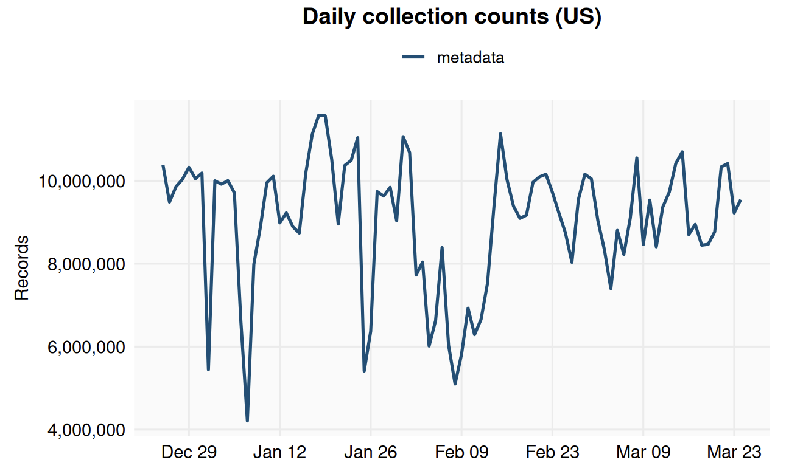{fig-align="center" width="90%"}

::: {.fragment style="text-align: center; font-style: italic; font-size: 0.9em; margin-top: 0.3em;"}
A near-complete census: **3.6B US posts** between Oct. 2024 and Oct. 2025.
:::

---

## Topic-specific production

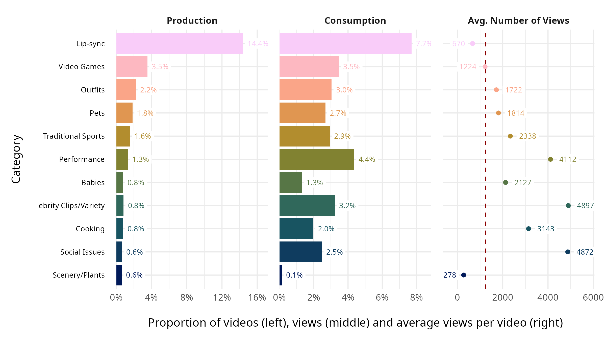{fig-align="center" width="92%"}

::: {.fragment style="text-align: center; font-style: italic; font-size: 0.9em; margin-top: 0.3em;"}
Entertainment dominates **production and consumption**; political topics are a thin slice, yet earn **high average views**.
:::

---

## Topic-specific engagement

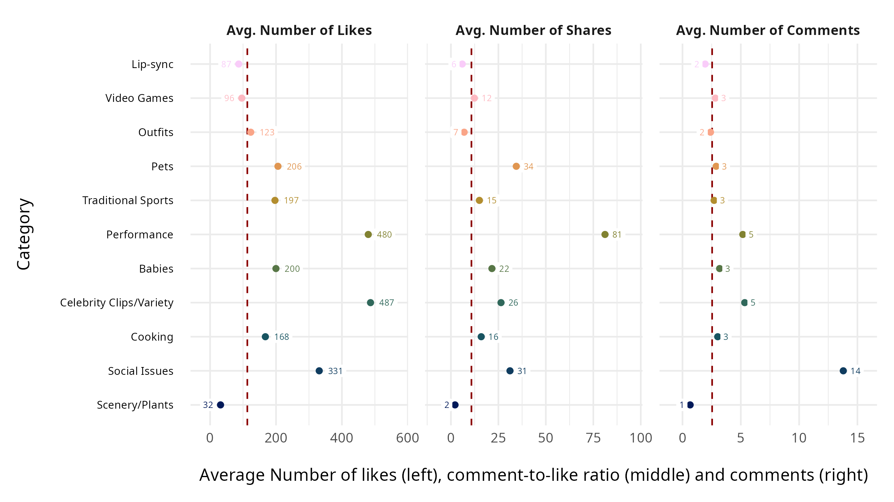{fig-align="center" width="92%"}

::: {.fragment style="text-align: center; font-style: italic; font-size: 0.9em; margin-top: 0.3em;"}
**Social Issues** draws far more **comments** per video: political content provokes conversation, not just views.
:::

---

## How much content is political over time?

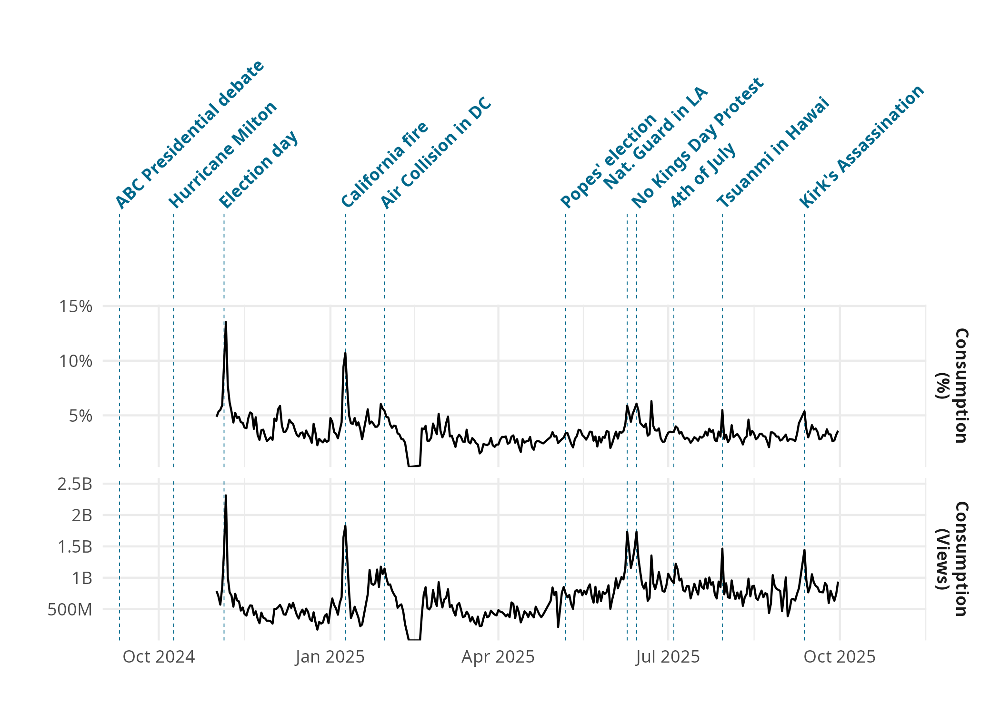{fig-align="center" width="90%"}

::: {.fragment style="text-align: center; font-style: italic; font-size: 0.9em; margin-top: 0.3em;"}
Both production and consumption of political content are **driven by events**.
:::

---

## Open question {background-color="#0D4F77" .center}

::: {style="color: white; font-size: 1.1em; text-align: center;"}
What kind of **ideological content** penetrates the platform best?
:::

---

## Centrist content is what works best

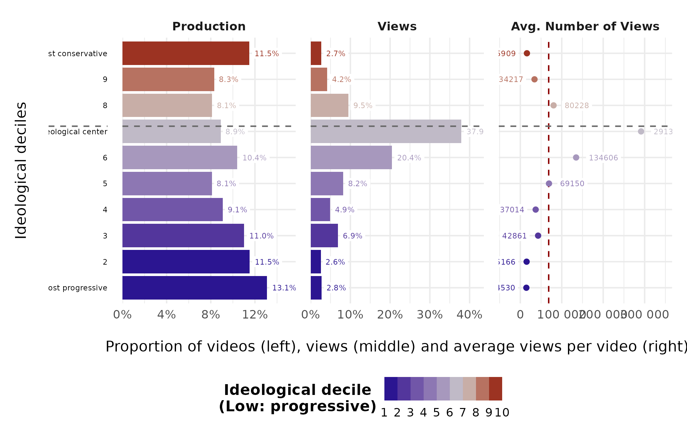{fig-align="center" width="80%"}

::: {.fragment style="text-align: center; font-style: italic; font-size: 0.9em; margin-top: 0.3em;"}
No clear algorithmic or demand bias toward the extremes; **moderate content is favored**.
:::

---

## So how to go viral?

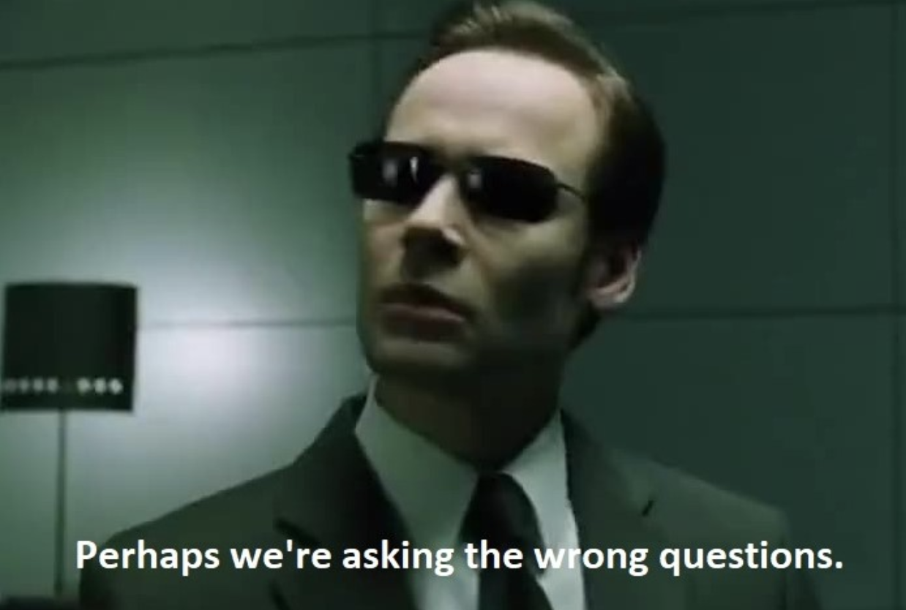{.fragment fig-align="center" width="62%"}

---

## Virality is an equilibrium, not a recipe

::: {.incremental}
- Whatever "works" **decays** as everyone copies it.
- The platform continuously pushes **new trends**: sounds, formats, challenges.
- To stay visible, producers must **keep following** them.
:::

::: {.fragment .fade-up style="margin-top: 1em; text-align: center; font-style: italic; font-size: 1.05em;"}
Agenda-setting moves **one level up**: not *which stories*, but **which forms and rhythms** of storytelling.
:::

---

## The attention dream

::: {.incremental}
- TikTok promises that **any producer** can earn attention, as long as their content is **good**.
- It has been celebrated as a **beacon democratizing content production**.
:::

::: {.fragment .fade-up style="margin-top: 1em; text-align: center; font-style: italic; font-size: 1.05em;"}
A meritocracy of attention?
:::

---

## In reality, attention is heavily skewed

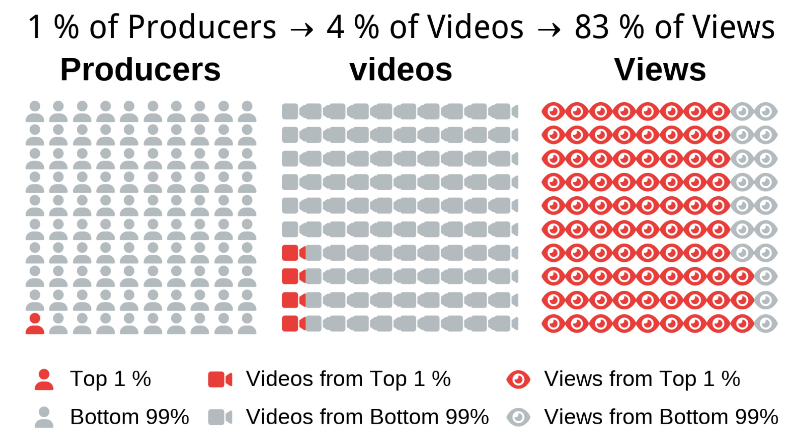{fig-align="center" width="78%"}

---

## In reality, attention is heavily skewed

```{=html}
<div style="position: relative; width: 80%; margin: 0 auto;">
  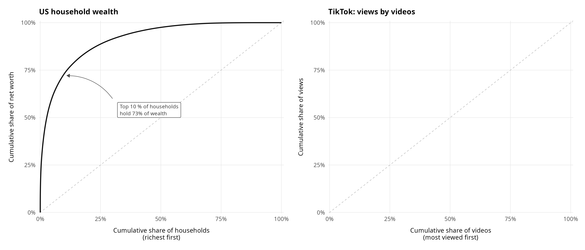
  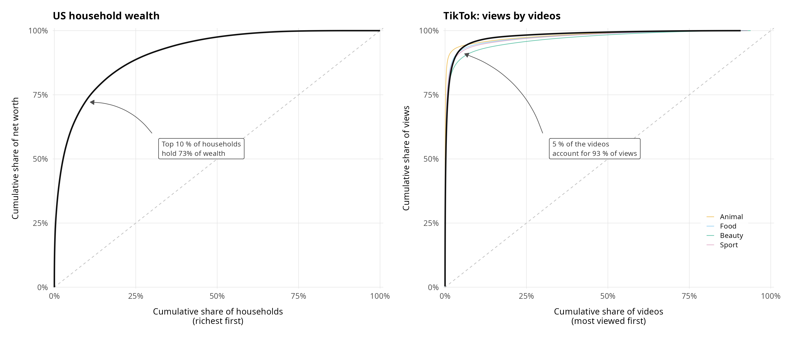
</div>
```

::: {.fragment style="text-align: center; font-size: 1.05em; margin-top: 0.3em;"}
A small **elite of producers** captures the overwhelming share of attention.
:::

---

## The real American attention dream

*How the platform sustains the illusion:*

::: {.incremental}
- Manufacture a few **high-attention producers**, so that becoming famous looks **feasible** to everyone.
- Spread the remaining attention **broadly enough** to keep producers **producing**.
:::

::: {.fragment .fade-up style="margin-top: 1em; text-align: center; font-size: 1.05em;"}
What most producers actually receive are the **super-crumbs**.
:::

---

## Which producers drive the conversation?

::: {style="text-align: center; font-size: 1.15em; margin-top: 1.5em;"}
Traditional news outlets now face competition from a **new type of producer**:\
**influencers and aggregators**.
:::

---

## The new attention elite *in the US*

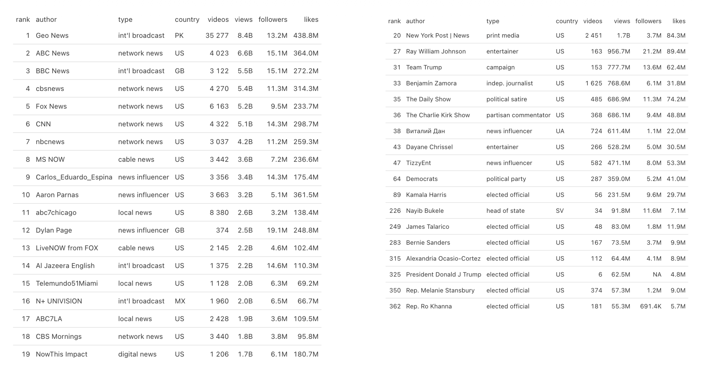{fig-align="center" width="82%"}

---

## The trend-driven news cycle accelerates

::: {.incremental}
- **Information quality** suffers: focus shifts to pace, format, and trends instead of substance.
- **Democracy** suffers: low deliberative quality, and simplified messages reward populism.
- **Media power** erodes: outlets become responsive to the platform rather than the reverse.
:::

---

## So, what can we do? {background-color="#0D4F77" .center}

::: {style="color: white; font-size: 1.1em; text-align: center;"}
Given everything we have discussed,\
what is in **journalism's** power to change?
:::

---

## Solution 1: Own your distribution

::: {.incremental}
- Treat platforms as the **top of the funnel**, never the **whole** funnel.
- If a platform is your **only** channel, you have **no leverage and no safety** (Hindman).
- Hiring charismatic creators is **risky**: they hold the audience and the leverage, and **they can walk**, taking the audience with them.
:::

::: {.fragment .fade-up style="margin-top: 1em; text-align: center; font-style: italic; font-size: 1.05em;"}
An audience reached only through **someone else's algorithm** is not an audience you **own**.
:::

---

## Solution 2: Regulation for transparency {.smaller}

::: {.incremental}
- **Platform accountability**: hold platforms responsible for what spreads on them.
- **Producer accountability**: make producers feel responsible for what they publish.
- **Transparency**: data access for researchers and journalists, plus technical specification of the algorithm, to reveal the **hidden costs** of profit maximization.
:::

::: {.fragment style="margin-top: 0.6em; padding: 0.5em; background: #eef3f8; border-left: 4px solid #0D4F77; border-radius: 4px; font-size: 0.85em;"}
In the EU, this is what the **DSA (Article 40)** is meant to deliver.
:::

---

## Appendix: How we obtain the data {background-color="#0D4F77" .center}

---

## Enumerating TikTok IDs

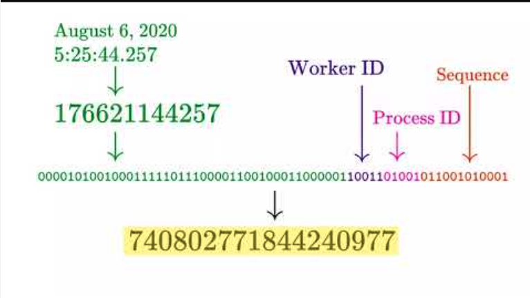{fig-align="center" width="80%"}

::: {.fragment style="text-align: center; font-size: 0.9em; margin-top: 0.3em;"}
Each post carries a numeric **ID** whose structure encodes its **creation time** (Steel et al. 2025).
:::

---

## Enumerating TikTok IDs

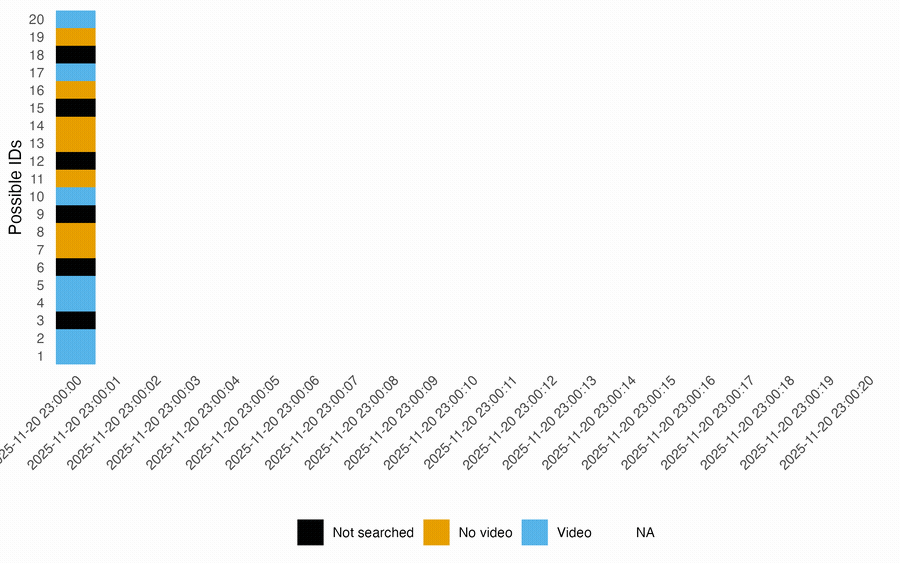{fig-align="center" width="80%"}

::: {.fragment style="text-align: center; font-size: 0.9em; margin-top: 0.3em;"}
Theoretically 4.3B IDs/second; in practice the search space narrows to ~400k candidates, **so we try them all**.
:::

---

## Overview of the collection infrastructure

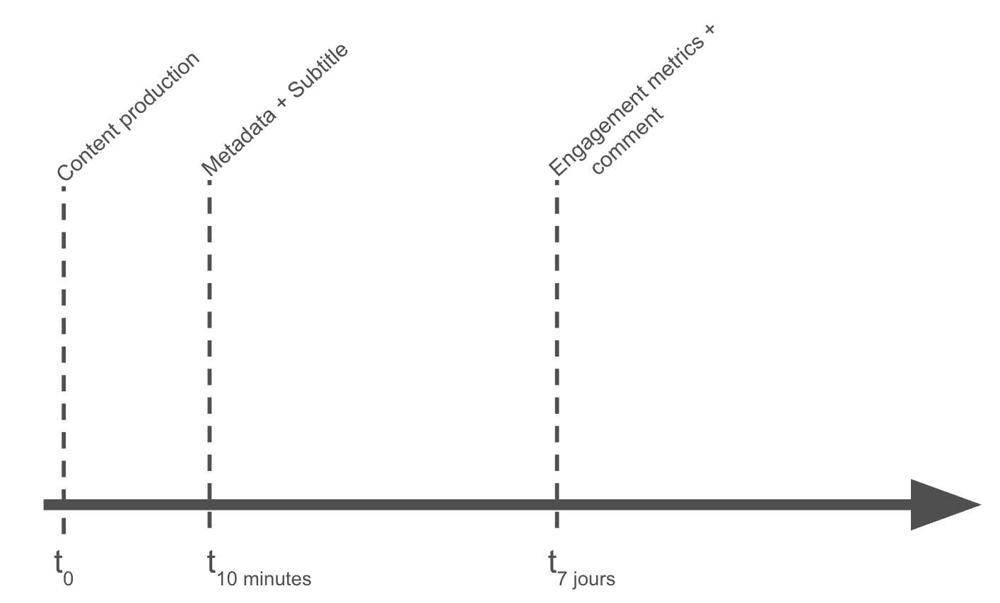{fig-align="center" width="85%"}

---

## How many data points? {.smaller}

::: {.columns}
::: {.column width="50%"}
{width="98%" fig-align="center"}

::: {style="text-align: center; font-size: 0.8em;"}
**3.6B** US posts (Oct. 2024 to Oct. 2025)
:::
:::

::: {.column width="50%"}
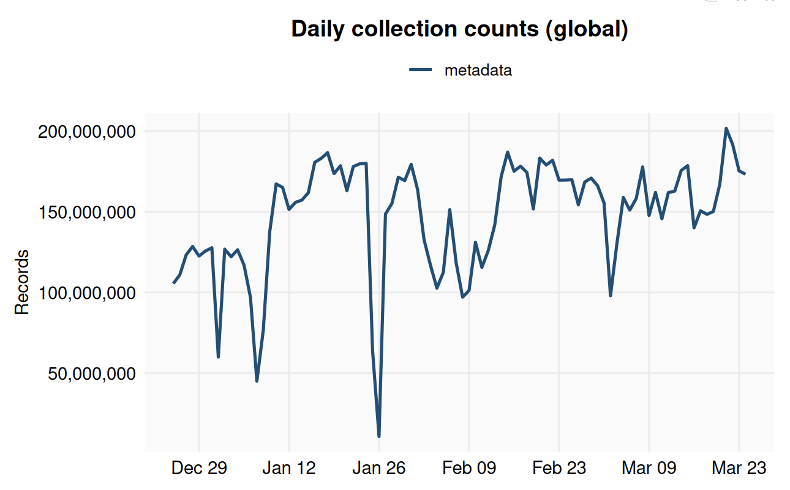{width="98%" fig-align="center"}

::: {style="text-align: center; font-size: 0.8em;"}
**90B** posts globally
:::
:::
:::

::: {.fragment style="text-align: center; font-size: 0.95em; margin-top: 0.4em;"}
Random coverage stabilizes around **80%**; roughly **1%** of content and **3%** of consumption is political.
:::
